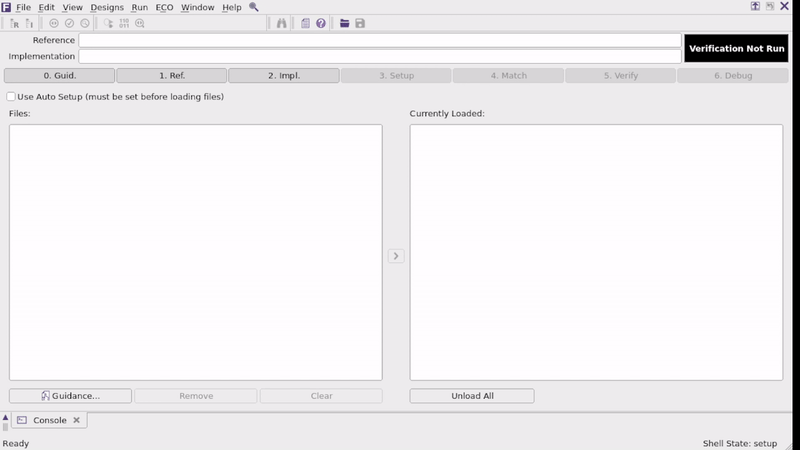
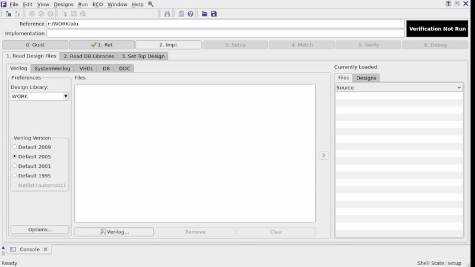
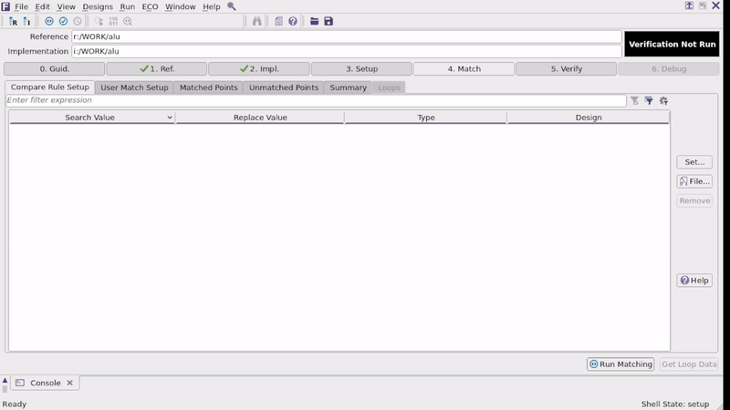

# Implementation of a RISC-V processor using the Synopsys Digital Design Flow

## Table of Contents
0. [Synospys Digital Design Flow](#synopsys-digital-design-flow)
1. [Specification](#specification)
2. [RTL: Cell description coding](#rtl-cell-description-coding)
3. [Console: Syntax Check](#console-syntax-check)
4. [VCS: Logic simulation](#vcs-logic-simulation)
5. [Logic Synthesis](#logic-synthesis)
6. [Formal Verification](#formal-verification)
7. [Pre-Layour STA (Prime Time)](#pre-layour-sta-prime-time)
8. [Floorplanning, placement & Routing](#floorplanning-placement-routing)
9. [Physical Verification](#physical-verification)
10. [Post-Layout STA (Prime Time)](#post-layout-sta-prime-time)
11. [Finished Design](#finished-design)
12. [Extras - Windows 10/11 Synopsys Server Connection](#extras---windows-1011-synopsys-server-connection)
    - [MobaXterm Connection](#mobaxterm-connection)
    - [RSA Key Generation - Needed for SSH Connection with VSC](#rsa-key-generation---needed-for-ssh-connection-with-vsc)
    - [Save RSA Public Key at Synopsys Server](#save-rsa-public-key-at-synopsys-server)
    - [Install and run Xlaunch](#install-and-run-xlaunch)
    - [VSCode SSH connection](#vscode-ssh-connection)
13. [References](#references)

## Synopsys Digital Design Flow 
The Digital Design Flow is the following

<div align="center">
      <a href="">
     
      </a>
</div>


## Specification

Design of a RISC-V processor. Implementation of an RV32I processor with a five-stage pipeline.

--- 

Diseño de un procesador RISC-V. Implementación de procesador RV32I con pipeline de cinco etapas:

Implementar un procesador RISC-V sencillo. En este caso el desafío no estaría tanto en el diseño en si, ya que hay varios que han implementado y verificado sus propias versiones de procesador en HDL. La idea es que teniendo un código base medianamente probado, el esfuerzo se enfoque en documentar el flujo de diseño en las capas más bajas de la implementación. El ya tener un RISC-V como base abre las puertas para posteriores proyectos que integren diversos periféricos. 

No se plantea el uso de FPGAs como un objetivo de los proyectos que desarrollaran los estudiantes. Se mencionaron las FPGAs en el contexto de que todos los participantes tienen experiencia en distintos grados en el flujo de diseño para FPGAs (algunos bien avanzados), por lo que la idea es justamente que extrapolen esa experiencia en las etapas de síntesis para preparar una actividad que muestre el flujo de diseño para un ASIC.


## RTL: Cell description coding

* Tests for a simple ALU, an adder, and other descriptions can be found in the `test_code` folder, with the aim of testing the design flow preliminarily.

* The description of a unicycle processor for testing the design flow can be found in the `Unicycle` folder.

* It is expected later to have a folder with the description of the RV32I processor.

## Console: Syntax Check

The command `vlogan <file(s)> -full64 –sverilog +v2k` gives a syntax error in the simulation part using SystemVerilog, so we opted for the following command:

``` 
vcs -sverilog -parse_only <archivo(s)>
```

Which checks the syntax and does not generate the simulation file `\sim` typical of the `vcs` command.

## VCS: Logic simulation
 
To start a simulation we run in the console the following command:

```
vcs -sverilog -debug -cpp -gcc -R -gui <achivo(s)>
```
Where `-R` runs the simulation (which should be added to the files as a testbench) immediately after compilation.

Other options for the VCS command are:

|Opciones de vcs   |                                            |
|------------------|--------------------------------------------|
| -debug           | Enable debug capabilities                  |
| -debug_all       | Enable source-line debugging               |
| -debug_pp        | Debug post-processing                      |
| -gui             | Start DVE after compilation finishes       |
| +define <macro>  | Defines macro in the verilog source        |
| -l <logfile>     | Create log file                            |
| -o <sim_name>    | Rename simulation executable               |
| -ucli            | Enable Tcl command-line interface          |
| -R               | Run simulation immediately after compile   |
| -cm <options>    | Enable coverage options                    |

If you want to run the simulation without running vcs again, you can do it using the following command:

``` 
./simv <options> 
```

Where you may use the following options:


|Opciones de ./simv|                                            |
|-----------------|---------------------------------------------|
| -ucli           | Stop at Tcl prompt upon start-up            |
| -i <run.tcl>    | Execute specified Tcl script upon start-up  |
| -l <logfile>    | Create runtime logfile                      |
| -gui            | Start interactive GUI session               |
| -xlrm           | Allows relaxed/non-LRM compliant code       |
| -cm <options>   | Enable coverage options                     |
| -cm_name        | Give name to the test (default is test)     |

## Logic Synthesis

Use the `logic_synthesis.tcl` file which takes care of everything.

To be specified:
- maximum area
- fanout
- set_max_transition
for now, test data was used.

The `logic_synthesis.tcl` file is run with the following command:

``` 
dc_shell -f logic_synthesis.tcl
``` 

And as a result, it displays information in the console, as well as data regarding timing, area, power, etc in the `report` folder.

Pending tasks
- Verify the results of the logic synthesis for the Unicycle or another simple description, especially the reported WNS.

## Formal Verification

For formal verification we use the formality tool.
It is important to check if you have access to this, as with the prime time tool, for this make sure that the following lines are found in `.bashrc` at the synopsys server:

```
PATH=/home/SynopsysSoftware/fm/R-2020.09-SP5/bin:$PATH     
PATH=/home/SynopsysSoftware/prime/R-2020.09-SP5-3/bin:$PATH
```

Once we have access to the tool, we can start the gui in the console with the following command:

```
formality
```

In the gui we follow the following steps:

* Cargar el RTL en la pestaña `1. Ref`:
<div align="center">
      <a href="">
     
      </a>
</div>

* Cargar la Netlist resultante de la sintesis logica en los pasos anteriores en `2. Impl.`:

<div align="center">
      <a href="">
     
      </a>
</div>

* Match y Verificacion:

<div align="center">
      <a href="">
     
      </a>
</div>


 --- 
 obs: 
 - For now, there are some WARNINGS regarding the unicicle's imem and dmem code, so the tutorial is based on a simple alu.
 - In the Overleaf there is some instructions in how to make the formal verification without GUI.
 --- 
Status:   Elaborating design imem   ...  
Warning: Index may take values outside array bound, may cause simulation mismatch .. (Signal: RAM Block: /imem File: /home/usuario12/RISC-V/Uniciclo/imem.sv Line: 9)  (FMR_ELAB-147)
Status:   Elaborating design dmem   ...  
Warning: Index may take values outside array bound, may cause simulation mismatch .. (Signal: RAM Block: /dmem File: /home/usuario12/RISC-V/Uniciclo/dmem.sv Line: 8)  (FMR_ELAB-147)


## Pre-Layour STA ( Prime Time )

Text

## Floorplanning, placement & Routing

### Floorplan:

Correr en la consola el siguiente comando (sigue en construccion): 

```
icc2_shell -gui -f icc2_test.tcl
```

---

obs: Por el momento tenemos los siguientes problemas:

* icc2: no se pueden hacer operaciones de optmizacion como place_opt, clock_opt ni route_opt.
* icc2: no existen los pines de salida de vcc ni vdd, no sabemos porque.
* formality: No es posible setear el top del codigo de uniciclo, error de index may take values oustide array bound en dmem e imem

## Physical Verification

Text

## Post-Layout STA ( Prime Time )

Text

## Finished Design

Text

# EXTRAS - WINDOWS 10/11 SYNOPSYS SERVER CONNECTION


## MobaXterm Connection

* algun dia lo explico si es necesario para ser auto contenido...


## RSA Key Generation - Needed for SSH Connection with VSC

* Open cmd and type `ssh-keygen -t rsa -b 2048`
* If it's your first time generating a key, you can use the default file to save the key
* passphrase can be let empty
* now the public and private key are (usually) saved at `C:\Users\<user_name>\.ssh\`


## Save RSA Public Key at Synopsys Server

* Enter the server (using your username and password given) 
* once there, go to the `.ssh` folder and create the `authorized_keys` file, open it and paste the content of the `id_rsa.pub` created earlier


## Install and run Xlaunch

* Install VcXsrv Windows X Server (`https://sourceforge.net/projects/vcxsrv/`)
* run it with default options

## VSCode SSH connection

* Install `Remote -SSH`, `Remote X11` and `Remote X11 (SSH)` extension in VSC
* Open command palette > Remote-SSH: Open SSH Configuration File.. > .../.ssh/config
* Edit it as follows:

      Host synopsys.elo.utfsm.cl
            HostName synopsys.elo.utfsm.cl
            Port 22
            User usuarioXX
            IdentityFile C:\Users\<user_name>\.ssh\id_rsa
            ForwardAgent yes
            ForwardX11 yes
            ForwardX11Trusted yes
            XAuthLocation "C:\Program Files\VcXsrv\xauth.exe"
* In VSC `Settings`, be sure that `Remote X11.SSH: Private Key` is set as the `IdentityFile` from the previous step

*  In VSC `Settings`, be sure to have `Remote X11.SSH: XAuth Permission Level` as `trusted` 

<div align="center">
      <a href="">
     
      </a>
</div>

* In VSC `Settings` be sure to have `Remote X11.SHH: Enable` selected.

<div align="center">
      <a href="">
     
      </a>
</div>


# References

* VSC X11 SSG connection: `https://github.com/microsoft/vscode-remote-release/issues/4600#issuecomment-791332086`
* RSA key generation and linking to VSC: `https://www.youtube.com/watch?v=PDVnUErS_us`

* Formality tutorial: `https://www.youtube.com/watch?v=CFRqPnqifx0`

* ICC tutorial: `https://www.youtube.com/watch?v=BQxG3jzcifg`
