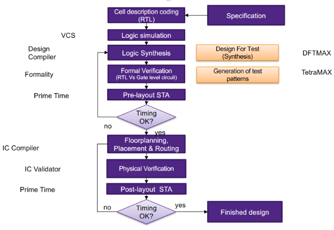
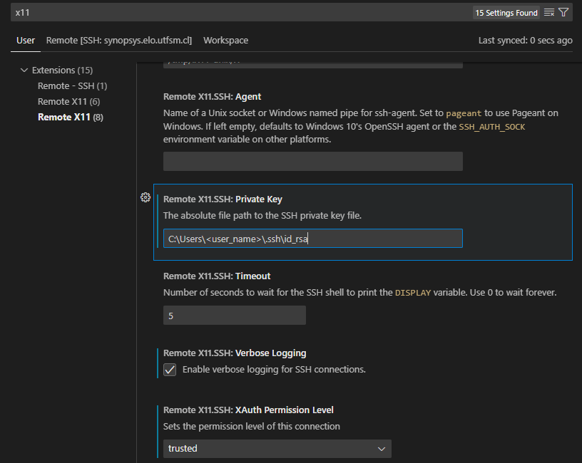
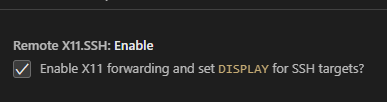

# Implementation of a RISC-V proccessor using the Synopsys Digital Design Flow

The Digital Design Flow is the following:

<div align="center">
      <a href="">
     
      </a>
</div>


## Specification

Diseño de un procesador RISC-V. Implementación de procesador RV32I con pipeline de cinco etapas:

Implementar un procesador RISC-V sencillo. En este caso el desafío no estaría tanto en el diseño en si, ya que hay varios que han implementado y verificado sus propias versiones de procesador en HDL. La idea es que teniendo un código base medianamente probado, el esfuerzo se enfoque en documentar el flujo de diseño en las capas más bajas de la implementación. El ya tener un RISC-V como base abre las puertas para posteriores proyectos que integren diversos periféricos. 

No se plantea el uso de FPGAs como un objetivo de los proyectos que desarrollaran los estudiantes. Se mencionaron las FPGAs en el contexto de que todos los participantes tienen experiencia en distintos grados en el flujo de diseño para FPGAs (algunos bien avanzados), por lo que la idea es justamente que extrapolen esa experiencia en las etapas de síntesis para preparar una actividad que muestre el flujo de diseño para un ASIC.


## RTL: Cell description coding

Por ahora hare las pruebas de diseño en el codigo de sumador presentado en la carpeta `test_code` donde se describe un sumador simple.

Se espera más adelante tener una carpeta con el codigo del procesador RV32I.

## Consola: Syntax Check

Usando el comando `vlogan <archivo(s)> -full64 –sverilog +v2k` me tira un error de sintaxis en la parte de simulación usando SystemVerilog, por lo que opte por este comando:

``` 
vcs -sverilog -parse_only <archivo(s)>
```

El cual revisa la sintaxys y no genera el archivo de simulacion `sim` propio del comando `vc`.

## VCS: Logic simulation
 
Para correr una simulación corremos en consola:

```
vcs -sverilog -debug -cpp -gcc -R -gui <achivo(s)>
```
Donde `-R` corre la simulación (que debe añadirse en los archivos como un testbench) inmediatamente despues de la compilación.

otras opciones para el comando VCS son:

|Opciones de vcs   |                                            |
|------------------|--------------------------------------------|
| -debug           | Enable debug capabilities                  |
| -debug_all       | Enable source-line debugging               |
| -debug_pp        | Debug post-processing                      |
| -gui             | Start DVE after compilation finishes       |
| +define <macro>  | Defines macro in the verilog source        |
| -l <logfile>     | Create log file                            |
| -o <sim_name>    | Rename simulation executable               |
| -ucli            | Enable Tcl command-line interface          |
| -R               | Run simulation immediately after compile   |
| -cm <options>    | Enable coverage options                    |

Si deseas correr la simulación sin volver a correr vcs, puedes hacerlo usando el siguiente comando:

``` 
./simv <options> 
```

donde las opciones disponibles son:


|Opciones de ./simv|                                            |
|-----------------|---------------------------------------------|
| -ucli           | Stop at Tcl prompt upon start-up            |
| -i <run.tcl>    | Execute specified Tcl script upon start-up  |
| -l <logfile>    | Create runtime logfile                      |
| -gui            | Start interactive GUI session               |
| -xlrm           | Allows relaxed/non-LRM compliant code       |
| -cm <options>   | Enable coverage options                     |
| -cm_name        | Give name to the test (default is test)     |

## Logic Synthesis

Usamos el archivo `logic_synthesis.tcl` que se encarga de todo.

falta:

- estamos seguros de la libreria skywalk130 que use?
- el reloj
- area maxima
- fanout
- set_max_transition

por ahora se usaron datos de prueba.

El archivo `logic_synthesis.tcl` se corre con el siguiente comando:

``` 
dc_shell -f logic_synthesis.tcl
``` 

Y como resultado despliega información en consola, así como datos respecto al timing, area, power, etc en la carpeta `report`.


## Formal Verification

hasta aqui llegamos.

# EXTRAS

## RSA KEY GENERATION

* Open cmd and type `ssh-keygen -t rsa -b 2048`
* If it's your first time generatin a key, you can use the default file to save the key
* passphrase can be let empty
* now the public and private key are (usually) at `C:\Users\<user_name>\.ssh\`

## SAVE RSA PUBLIC KEY AT SYNOPSYS SERVER

* Enter the server (using your username and password given)
* once there, go to `.ssh` and create the `authorized_keys` file, open it and paste the content of the `id_rsa.pub`created in early

## INSTALL Xlaunch

* Install VcXsrv Windows X Server (`https://sourceforge.net/projects/vcxsrv/`)

## VSCode SSH connection

* Install `Remote -SSH`, `Remote X11` and `Remote X11 (SSH)` extension
* Open command palette > Remote-SSH: Open SSH Configuration File.. > .../.ssh/config
* Edit it as follows:

      Host synopsys.elo.utfsm.cl
            HostName synopsys.elo.utfsm.cl
            Port 22
            User usuario12
            IdentityFile C:\Users\<user_name>\.ssh\id_rsa
            ForwardAgent yes
            ForwardX11 yes
            ForwardX11Trusted yes
            XAuthLocation "C:\Program Files\VcXsrv\xauth.exe"
* In VSC `Settings`, be sure to have `Remote X11.SSH: Private Key` set as the `IdentityFile` from the previous step

*  In VSC `Settings`, be sure to have `Remote X11.SSH: XAuth Permission Level` as `trusted` 

<div align="center">
      <a href="">
     
      </a>
</div>

* In VSC `Settings` be sure to have `Remote X11.SHH: Enable` selected.

<div align="center">
      <a href="">
     
      </a>
</div>

# References

* VSC X11 SSG connection: `https://github.com/microsoft/vscode-remote-release/issues/4600#issuecomment-791332086`
* RSA key generation and linking to VSC: `https://www.youtube.com/watch?v=PDVnUErS_us`